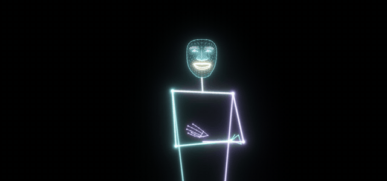
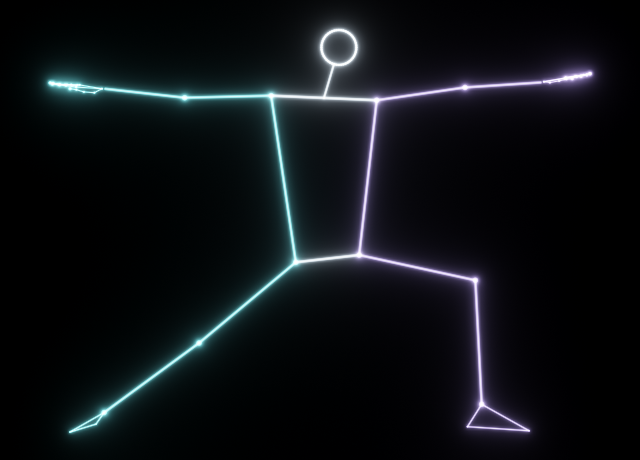
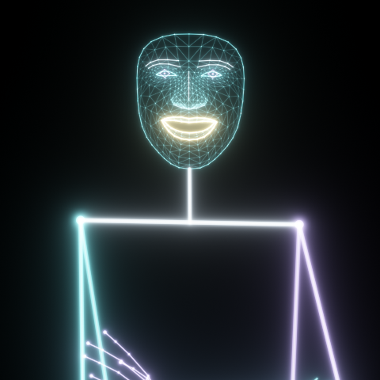
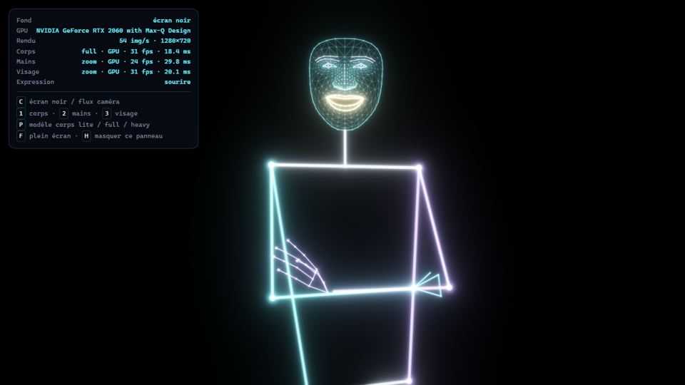

# Dopplor

An augmented mirror that draws your body back at you in light.



Dopplor is a rewrite of [Second Self](https://www.paulpeterarslan.com/projects/second-self), an augmented mirror I built in 2021. The setup is the same: a screen sits behind a one-way mirror and a webcam watches you. The screen draws a neon version of your skeleton, hands and face on top of your reflection. Black pixels don't show through the glass, so all you see on the mirror is the light.

This version runs entirely in the browser.

## What it tracks

| Body | Face |
| --- | --- |
|  |  |

- **Body**: 33 points (MediaPipe Pose, lite / full / heavy)
- **Hands**: 21 points per hand
- **Face**: the 478-point mesh, plus the 52 blendshapes. I use them to make the face react: a smile turns the lips gold, an open mouth lights up, raised eyebrows glow, frowning turns them red, a closed eye switches its iris off.

## How it works

A few things that took some trial and error:

**Hands and face are searched near the body, not in the whole frame.** Out of the box, the hand and face models get the full webcam image shrunk down to ~200 px. That's fine for a selfie, but from two meters away your face is a few pixels wide and nothing gets detected. Instead, the body skeleton tells me where the head and wrists are, so I crop those regions at full resolution and feed the crops to the models (same idea as MediaPipe Holistic). The face now gets picked up from across the room.

**Fast hands.** The wrist crop is placed where the wrist is *going* (extrapolated from its speed), and grows when you move fast. If the hand still gets lost (motion blur), it stays attached to the wrist for half a second instead of vanishing.

**Nothing blocks the drawing.** Each model runs in its own Web Worker on the GPU. Camera frames are handed over as `VideoFrame`s, without copies. A busy worker skips frames instead of queueing them, so latency doesn't pile up.

**Smoothing** uses the One Euro filter: heavy smoothing when you're still (no jitter), light smoothing when you move (no lag).

**Prediction.** Even with everything above, the camera, the processing and the screen add up to a visible delay. So, like VR headsets do, the skeleton is drawn where it *will be* when the frame hits the screen, by extending each point's velocity. On a test video with a regular back-and-forth motion, this took the delay of the processing chain from 91 ms down to about 0. It's adjustable live with the arrow keys: too much and the figure overshoots when you stop abruptly.

**Rendering** is plain WebGL2, no engine. Every bone is an instanced quad shaded with a distance field. Everything is drawn into an HDR buffer, then bloomed with a mip chain and tone mapped. The background is clamped to true black, because on a one-way mirror even a faint grey haze shows up.

## Modes

At startup only the skeleton is on. Each mode is switched on and off from the menu: pick it to turn it on, pick it again to turn it off, and the bubbles of the modes that are on glow brighter. The skeleton can be added on top of the other modes; sign language, dance and the fairy are activities, one at a time. In these, your own skeleton is only drawn if the skeleton mode is on. `Escape` closes the menu, then stops the activity, then turns the skeleton off. The debug panel is hidden by default (`H`).

To open the mode menu, make a fist with the palm facing the sky (it lights up), then open it in one go, as if throwing the menu up. The menu shoots out of your fingers. No waiting: the fist only needs to be there before the hand opens.

A fist opening quickly is everywhere in sign language: on about 100 LSF videos (4.5 minutes of signing), a plain fist-then-open fired 36 times. Requiring the palm to face up, on the fist and on the open hand, brings that down to 6. The palm direction comes from the depth MediaPipe estimates for each hand point, which gets noisy when the hand is small in the image, so it's taken as the best of the last three frames. An earlier version made you hold the fist still for 0.4 s instead; it filtered as well but didn't feel smooth. Opening the hand facing the mirror, slowly, while lowering it, or at hip level does nothing. After you close the menu with your fist, opening the hand again won't relaunch it.

Point with the index finger and rest on a mode, or pinch thumb and index to pick it right away. The menu doesn't go away on its own when you lower your hand: close your fist and keep it closed, and the menu folds back into your hand (open the fist early to cancel). It's also put away if nobody is in front of the mirror anymore. `M` opens it from the keyboard.

The menu is drawn by the same WebGL pipeline as the skeleton (neon strokes, same bloom); the first version used CSS glows, which got very slow on a 4K screen.

- **Skeleton**: the default, body + hands + face in neon.
- **Sign language (LSF)**: the word to learn is shown at the top, a golden double of you signs it on loop, and a gauge shows how close you are. Get it right and it moves on to the next one. The double plays the sign smoothly at the screen's frame rate: the recordings are 15 frames a second with a few gaps, so frames are interpolated, missing hands are filled in, and at the end it holds the pose and glides back to the start instead of jumping. It keeps its side next to you and follows you gently. Stuck? It moves on by itself after 30 seconds. Do a word you've already learned and the mirror tells you which.
- **Dance**: the golden double stands right on your reflection, same feet and same size, so you just have to match it. It invites you by raising its arms; raise both of yours (or press space) and the music starts, with a "3, 2, 1, Danse !" on the beat. A faint trail shows where its hands are going over the next beat, and the next marked pose shows up as a barely visible echo that firms up as the beat gets close. The upcoming moves also scroll in at the bottom as little neon figures and reach a marker right on the beat. Each marked pose gets a word above your head (Parfait, Super, Bien, Oups), sparks fly from your hands, your skeleton flashes gold on a perfect, and a combo multiplies the points. At the end, a score and up to three stars; raise your arms to dance again.
- **Fairy**: a little fairy of light lives behind the mirror. She flies around your reflection, in 3D, in the space behind the glass, and when she goes behind you she disappears behind your reflection, like a real object would. Hold a hand out flat, palm up: she notices it with a little spin, spirals in and lands on your palm, wings slowing down, her light breathing, hopping now and then; she follows your hand. Bring your other flat hand close and she hops over; pull your hand away and she falls for a moment, tumbling, before her wings catch her and she flies again; close your hand and she hops off, and a sudden move startles her away. She turns to face where she flies, so you see her from the side or from behind, not only from the front. With nobody there, she wanders in the middle of the mirror. To hide her, the server sends a depth map of your body as seen in the reflection: every depth pixel of your body is lifted to 3D and projected exactly like the skeleton.

There's no public model for French Sign Language, and I didn't want to make signs up. The signs come from [Lingua Libre](https://lingualibre.org), where people record words in LSF and publish them on Wikimedia Commons under free licenses (CC0 / CC BY-SA). `scripts/import_lsf.py` downloads those videos, runs the same pose and hand models on them and keeps only the movement (upper body and both hands, 15 frames a second). Lingua Libre also has a lot of library vocabulary (conseiller, réservation…), so only about 30 simple everyday words are kept (`WORDS` in the script): greetings, please and thank you, questions, a few verbs and some animals. They're in `data/lsf/`. Credits are in [data/lsf/ATTRIBUTION.md](data/lsf/ATTRIBUTION.md), and the mirror shows who signed the word on screen.

The movement is both what the double replays and the reference it compares you to. The comparison uses dynamic time warping on hand placement relative to the body and hand shape relative to the palm, so it doesn't care how tall you are or how fast you sign. It also accepts the sign done with the other hand, and it wants the movement, not just the right pose. The threshold was tuned on simulated imitators: other body proportions, other speed, sloppier hands. Looking like the sign isn't enough, you have to actually do it. The part of your movement matched to the sign has to last at least half the sign, so a held pose can't be squeezed onto it. The gesture also has to cover at least half the amplitude of the original, measured as how far the wrist travels from end to end. Measuring the path length instead was fooled by tracking jitter: with realistic jitter, simply holding your hands up validated the sign 43% of the time and idly moving them 40%. It's 1% and 2% now, while imitations still pass 92 to 96% of the time. This still needs tuning with real people; `scripts/record.py` records what the mirror sees so it can be replayed.

You can add your own signs: someone who knows LSF presses `R`, signs once in front of the mirror and names it. They're stored by the Python server in `signs/`.

The music is generated in the browser with Web Audio: a 112 BPM house-funk groove in A minor (kick, clap, hats, bass, chord stabs, an arpeggio with echo, a noise riser before the last part), about 1 min 15. Nothing to download, no rights issues, and the choreography lands exactly on the beat because every note is known. The double's timing follows the audio clock, corrected for output latency. The choreography is 15 moves (balance, V arms, robot, wave, disco, push, clap, star, leg…) written as key poses on the beats, with sharp or smooth transitions and a knee bounce on every beat. A pose is scored on the direction of each arm segment, the legs when the move uses them and they're in view, and the lean of the torso, keeping the best match in a window from 0.15 s before to 0.4 s after the beat (you react to the double). Doing the exact pose scores 100%, the same pose on the wrong side mostly "Oups", and standing still with the arms down never gets a "Parfait": poses that look like standing still aren't scored.

## Lining up with the reflection

A camera image and a reflection don't line up: your reflection sits behind the glass, as far back as you are in front, and where you see it depends on where your eyes are. So the overlay has to be drawn where the line from your eye to your reflection crosses the glass. That needs three things in 3D:

- **your body**: the Femto Bolt's depth camera gives the distance, MediaPipe's relative depth gives the relief between the joints (more robust than reading depth point by point when an arm passes in front of the body);
- **your eyes**: from the iris landmarks;
- **where the camera is relative to the screen**: its tilt comes from its accelerometer, its position from three tape measurements entered once in the calibration panel (`K`).

The first idea was to calibrate by touching the mirror at targets, but a camera mounted on the mirror can't see a finger on the glass. The next step, once the glass is in, is a calibration by sight: close one eye, put the reflection of the other on a few targets, and solve for the camera position from where the eye was each time.

The reflection maths are checked in `server/test_mirror.py` (a point on the glass is drawn where it is, your own eye is seen straight ahead, a point as far as your eye is seen halfway...).

One limit is physical and applies to every augmented mirror: the drawing is on the glass while your reflection is twice as far, so both eyes can't focus on both at once. The alignment is exact for a point between the eyes.

## Running it

There are two ways to run it. In both cases the page and the neon rendering are the same, only the tracking moves.

### On the mirror: Python server (lowest latency)

On the actual mirror, a small Python server reads the camera and runs MediaPipe natively on the GPU, then streams the landmarks to the page over a WebSocket. The browser only draws.

Why: on the demo PC (Ubuntu, RTX 2080) native MediaPipe runs the full body model in 4.6 ms, against ~20 ms in the browser on a laptop GPU. The camera is read as raw YUYV, which takes 0.6 ms per frame instead of 16 ms to decode MJPG. Frames are never queued: if the models fall behind, old frames are dropped.

```bash
./scripts/setup.sh    # once, on a fresh Ubuntu 24.04: system packages, Chromium, then update.sh
./scripts/update.sh   # git pull, builds the page, installs the Python deps (and Node if missing)
./scripts/demo.sh     # starts the server, then Chromium fullscreen on the mirror screen
./scripts/demo.sh --rotate 90   # if the camera is mounted sideways for a portrait screen
./scripts/demo.sh stop
```

`demo.sh` also works over SSH: it opens Chromium on the screen of the logged-in user. Logs go to `~/.cache/dopplor`. Run `.venv/bin/python server/server.py --help` for camera options (resolution, exposure, pose model...). There's also a `--video file.mp4` option to test without a camera.

### On a laptop: everything in the browser

You need Node 20+, Chrome or Edge, and a webcam.

```bash
npm install   # also copies the MediaPipe runtime and downloads the models into public/
npm run dev
```

Then open http://localhost:5173 and allow the camera. The first launch takes a few seconds while the GPU compiles the models; after that it's cached.

On a laptop with two GPUs, Windows usually runs the browser on the integrated one, which is several times slower. Set the browser to "High performance" in *Settings → System → Display → Graphics*. The debug panel shows which GPU is in use, and turns orange if it's the integrated one.

## Controls

| Key | |
| --- | --- |
| `C` | black screen / camera feed |
| `1` `2` `3` | toggle body / hands / face |
| `P` | cycle the body model: lite, full, heavy |
| `↑` `↓` | more / less prediction (latency compensation) |
| `M` | mode menu (or open a palm-up fist in one go) |
| `R` `←` `→` `Suppr` | sign language mode: record a sign, previous / next, delete |
| `Espace` | dance mode: start / stop the music |
| `K` | calibration panel (alignment with the reflection) |
| `F` | fullscreen |
| `H` | hide the debug panel |



The panel shows the GPU, the speed of each model, whether hands and face run on crops ("zoom") or on the full frame, and the expression currently detected. The UI is in French.

## Code

```
server/
  server.py          web server + WebSocket, serves the built page
  capture.py         camera thread (latest frame only)
  vision.py          MediaPipe pipeline, hand/face crops from the skeleton
  orbbec.py          Femto Bolt through the Orbbec SDK: color, depth, accelerometer
  mirror.py          3D landmarks and where the eye sees their reflection
  occlusion.py       the body as seen in the reflection, with its depth (fairy mode)
src/
  main.ts            picks the source (Python server or browser), render loop, debug panel
  calibration.ts     calibration panel
  modes/
    menu.ts          mode menu driven by the hand
    gestures.ts      hand shape (fist, pinch, palm up), the menu gesture
    sign-language.ts sign language mode (learning, golden double, recording)
    signs.ts         sign recording, comparison (DTW) and storage
    ghost.ts         smooth playback of a sign by the golden double
    dance/
      dance-mode.ts  dance mode (flow, double, feedback, timeline)
      choreo.ts      moves, the double's skeleton, scoring
      music.ts       the generated music (Web Audio) and its clock
    fairy/
      fairy-mode.ts  fairy mode (where she flies, the raised hand)
      fairy.ts       the fairy (glow, wings, sparkles)
      world.ts       3D behind the glass (Three.js): eye perspective, occlusion by the reflection
  scene.ts           tracking, smoothing, expressions
  vision/
    remote.ts        landmarks from the Python server
    web-source.ts    webcam + workers, when there's no server
    vision.worker.ts MediaPipe inference in the browser (one worker per model)
    roi.ts           where to look for hands and face, from the skeleton
    client.ts        main thread side of a worker
  render/
    neon-renderer.ts WebGL2 pipeline (segments, bloom, tone mapping)
    figures.ts       turns body / hands / face into glowing segments
    shaders.ts
scripts/
  setup-assets.mjs   fetches the models
  update.sh          updates the demo PC from GitHub
  demo.sh            starts the demo
```

## Not done yet

- The calibration by sight, once the mirror glass is in. For now the camera position is measured by hand.
- One person at a time.
- Very fast hand moves still drop out on a 30 fps webcam. A 60 fps camera helps a lot.

## Credits

- [MediaPipe](https://ai.google.dev/edge/mediapipe) for the pose, hand and face models
- Bloom filters from Jorge Jimenez, *Next Generation Post Processing in Call of Duty: Advanced Warfare* (SIGGRAPH 2014)
- One Euro filter: Casiez, Roussel & Vogel, CHI 2012

The screenshots come from test videos played through a fake webcam, so no one had to stand in front of the camera.
